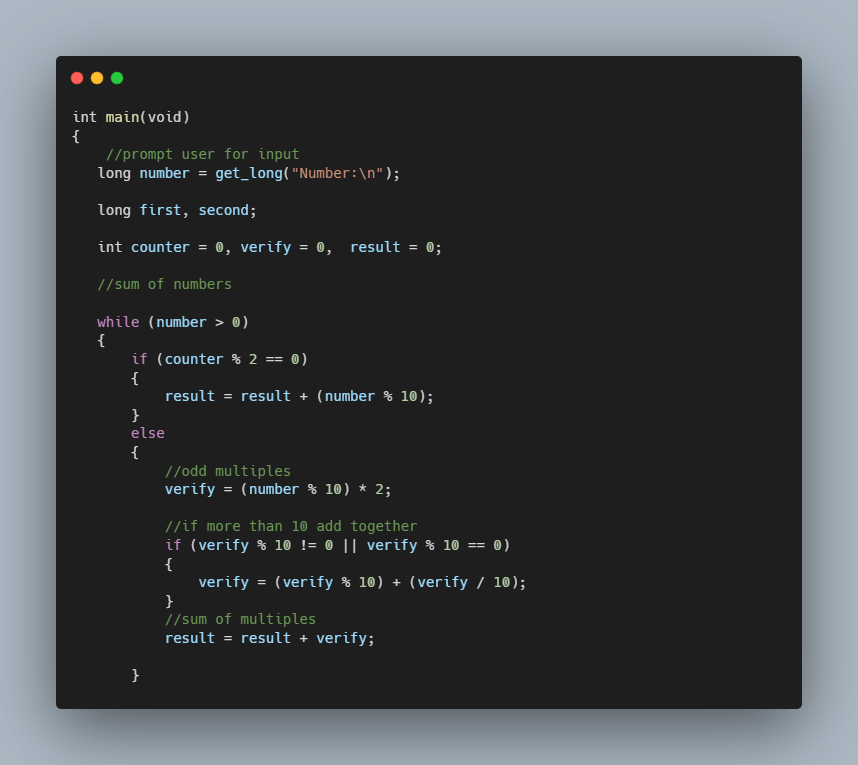

# Credit - CS50

### Description

Using Luhn's Algorithm, create a progam which check wether a credit/debit card is vaild.

If vaild verify which type of card has used as input by the user.

### How to use

1. Multiply every other digit by 2, starting with the number’s second-to-last digit, and then add those products’ digits together.
2. Add the sum to the sum of the digits that weren’t multiplied by 2.
3. If the total’s last digit is 0 (or, put more formally, if the total modulo 10 is congruent to 0), the number is valid!

./credit

Number: 4003600000000014

_VISA_

### Technologies
- C Programming

### Code Snippet

